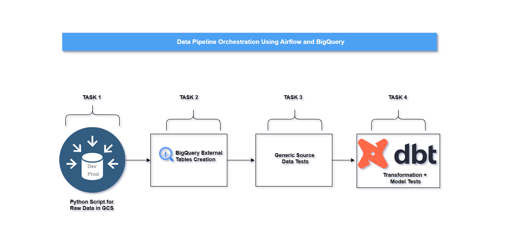
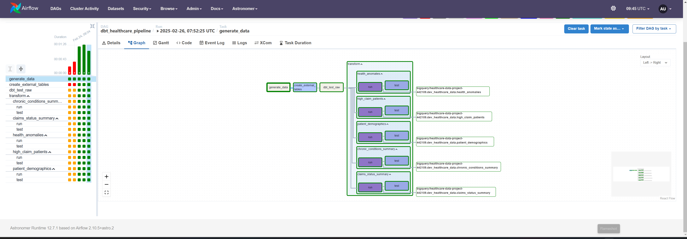
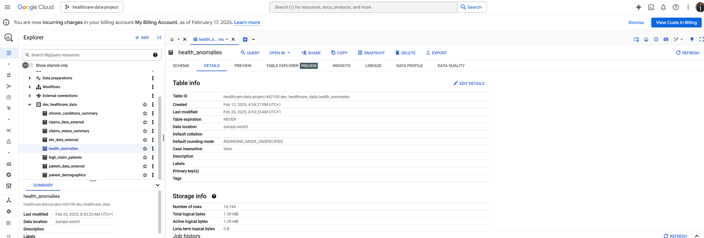
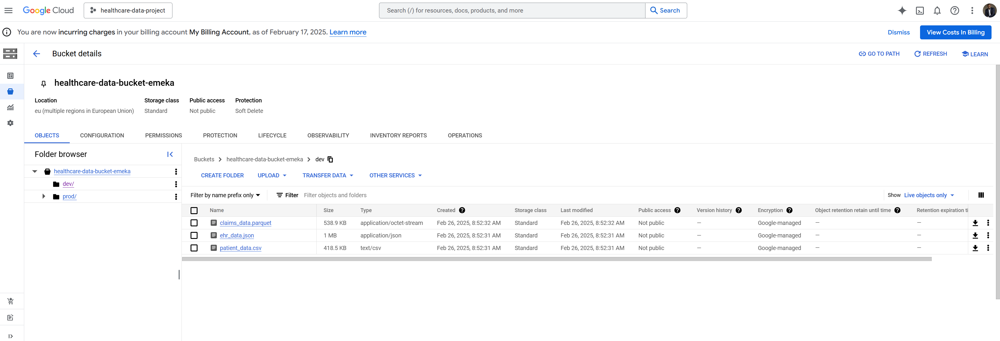

# Comprehensive Step-by-Step Guide: Airflow Orchestration with BigQuery and dbt

This guide walks you through setting up a data pipeline using Apache Airflow, Google BigQuery, and dbt, automating healthcare data workflows with clear, actionable steps. This project is developed and explained by Emeka. The video demonstration can be found in this [Youtube link](https://youtu.be/bBVQ_DzXY44)

---
## Data Pipeline Overview
- **Description**: This image illustrates the data pipeline orchestration using Apache Airflow, Google BigQuery, and dbt, showing the sequence of tasks: generating raw data with a Python script for Google Cloud Storage (GCS), creating BigQuery external tables, performing generic source data tests, and executing dbt transformations and model tests.
- **Image**: 
---
## Table of Contents
- [Prerequisites](#prerequisites)
- [Step 1: Set Up Your Development Environment](#step-1-set-up-your-development-environment)
- [Step 2: Set Up Google Cloud Credentials](#step-2-set-up-google-cloud-credentials)
- [Step 3: Create the Project Structure](#step-3-create-the-project-structure)
- [Step 4: Modify the Dockerfile for Dependencies](#step-4-modify-the-dockerfile-for-dependencies)
- [Step 5: Create the Airflow DAG](#step-5-create-the-airflow-dag)
- [Step 6: Create External Tables in BigQuery](#step-6-create-external-tables-in-bigquery)
- [Step 7: Set Up dbt and Run Tests](#step-7-set-up-dbt-and-run-tests)
- [Step 8: Run dbt Transformations](#step-8-run-dbt-transformations)
- [Step 9: Switch Between Dev and Prod Environments](#step-9-switch-between-dev-and-prod-environments)
- [Step 10: Test and Deploy](#step-10-test-and-deploy) 
- [Result](#result)
- [Additional Tips](#additional-tips)
- [Resources](#resources)


## Prerequisites
- **What It Achieves**: Ensures you have the necessary tools and accounts to begin the project.
- **Details**:
  1. **Google Cloud Platform (GCP) Account**: Set up a project (e.g., `healthcare-data-project-442109`) with billing enabled, including GCS and BigQuery access.
     - [Google Cloud Documentation](https://cloud.google.com/docs)
  2. **Python Installed**: Version 3.8+ (check with `python --version`).
  3. **Astro CLI Installed**: Manages Airflow locally.
     - [Astro CLI Installation Guide](https://docs.astronomer.io/astro/cli/install-cli)
  4. **dbt Core Installed**: For BigQuery transformations.
     - [dbt Core Installation](https://docs.getdbt.com/docs/core/installation)
  5. **Basic Knowledge**: Familiarity with Airflow, dbt, and BigQuery.
     - [Airflow Docs](https://airflow.apache.org/docs/) | [dbt Docs](https://docs.getdbt.com/) | [BigQuery Docs](https://cloud.google.com/bigquery/docs)

---

## Step 1: Set Up Your Development Environment
- **What It Achieves**: Prepares a local environment to run Airflow and manage the project.
- **Details**:
  1. **Install Astro CLI**:
     - Install via the Astronomer guide and verify with `astro --version`.
  2. **Initialize an Astro Project**:
     - Run: `astro dev init`
     - Creates a project structure with `dags`, `include`, etc.
  3. **Start the Astro Development Server**:
     - Navigate: `cd <your-project-name>`
     - Run: `astro dev start`
     - Access Airflow UI at `http://localhost:8080`.

---

## Step 2: Set Up Google Cloud Credentials
- **What It Achieves**: Configures GCP authentication for Airflow to interact with BigQuery and GCS.
- **Details**:
  1. **Create a Service Account**:
     - In GCP Console, go to **IAM & Admin > Service Accounts**, create one with roles (`BigQuery Admin`, `Storage Admin`), and download `service_account.json`.
  2. **Configure Airflow Connection to GCP**:
     - Place `service_account.json` in `/usr/local/airflow/include/gcp/` (create this folder in Step 3).
     - Edit `.env`:
       ```
       AIRFLOW__CORE__TEST_CONNECTION=Enabled
       ``` 
     - In Airflow UI (**Admin > Connections**), add:
       - **Connection ID**: `gcp`
       - **Connection Type**: `Google Cloud`
       - **Project ID**: `healthcare-data-project-442109`
       - **Keyfile Path**: `/usr/local/airflow/include/gcp/service_account.json`
     - Test the connection.

---

## Step 3: Create the Project Structure
- **What It Achieves**: Organizes the project files for easy management and execution.
- **Details**:
  1. **Organize the `include` Folder**:
     - Inside your Astro project’s `include` folder, create:
       - `raw_data_generation`: For data generation scripts.
       - `gcp`: For the GCP service account JSON file.
     - **Note**: The `dbt` folder is now moved to the **root directory** (alongside `dags` and `include`), not inside `include`.
  2. **Add the Raw Data Generation Script**:
     - In `raw_data_generation`, create `healthcare_data.py` to generate and upload data to GCS (e.g., `gs://healthcare-data-bucket-emeka/dev/`).
     - The data generation script can be found here: [`healthcare_data.py`](./include/raw_data_generation/healthcare_data.py)

---

## Step 4: Modify the Dockerfile for Dependencies
- **What It Achieves**: Ensures all required libraries are installed in an isolated environment for Airflow.
- **Details**:
  1. **Update the Dockerfile**:
     - Edit `Dockerfile` in the project root:
       ```
       FROM quay.io/astronomer/astro-runtime:12.6.0

       ENV VENV_PATH="/usr/local/airflow/dbt_venv"
       ENV PATH="$VENV_PATH/bin:$PATH"

       RUN python -m venv $VENV_PATH && \
           source $VENV_PATH/bin/activate && \
           pip install --upgrade pip setuptools && \
           pip install --no-cache-dir dbt-bigquery==1.5.3 pandas Faker pyarrow numpy && \
           deactivate

       RUN echo "source $VENV_PATH/bin/activate" > /usr/local/airflow/dbt_env.sh
       RUN chmod +x /usr/local/airflow/dbt_env.sh
       ```
  2. **Restart Astro**:
     - Run: `astro dev restart`

---

## Step 5: Create the Airflow DAG
- **What It Achieves**: Defines the workflow orchestration logic using Airflow DAGs.
- **Details**:
  1. **Create the DAG File**:
     - In `dags`, create `healthcare_pipeline_dag.py`.
  2. **Import Required Modules**:
       ```
       from airflow.decorators import dag
       from pendulum import datetime
       from airflow.operators.bash import BashOperator
       from airflow.providers.google.cloud.operators.bigquery import BigQueryInsertJobOperator
       from cosmos.airflow.task_group import DbtTaskGroup
       from cosmos.constants import LoadMode
       from cosmos.config import RenderConfig, ProfileConfig, ProjectConfig
       from pathlib import Path
       ```
  3. **Define the DAG**:
       ```
       @dag(
           schedule=None,
           start_date=datetime(2024, 1, 1),
           catchup=False,
           tags=["healthcare"],
           doc_md="Orchestrates healthcare data pipeline with BigQuery and dbt"
       )
       def healthcare_pipeline():
           pass
       ```
  4. **Set Up Task 1: Raw Data Generation**:
     - **BashOperator Explained**: Executes shell commands or scripts (e.g., running a Python script) in Airflow tasks. [Read more](https://airflow.apache.org/docs/apache-airflow/stable/howto/operator/bash.html).
     - Add:
       ```
       PATH_TO_DATA_SCRIPT = "/usr/local/airflow/include/raw_data_generation/healthcare_data.py"
       generate_data = BashOperator(
           task_id="generate_data",
           bash_command=f"python {PATH_TO_DATA_SCRIPT}"
       )
       ```

---

## Step 6: Create External Tables in BigQuery
- **What It Achieves**: Links raw data in GCS to BigQuery for querying without duplication.
- **Details**:
  1. **Create the SQL File**:
     - In `raw_data_generation`, create `create_external_tables.sql`:
       ```
       CREATE OR REPLACE EXTERNAL TABLE `healthcare-data-project-442109.dev_healthcare_data.patient_data_external`
       OPTIONS (
           format = 'CSV',
           uris = ['gs://healthcare-data-bucket-emeka/dev/patient_data.csv'],
           skip_leading_rows = 1
       );

       CREATE OR REPLACE EXTERNAL TABLE `healthcare-data-project-442109.dev_healthcare_data.ehr_data_external`
       OPTIONS (
           format = 'NEWLINE_DELIMITED_JSON',
           uris = ['gs://healthcare-data-bucket-emeka/dev/ehr_data.json']
       );

       CREATE OR REPLACE EXTERNAL TABLE `healthcare-data-project-442109.dev_healthcare_data.claims_data_external`
       OPTIONS (
           format = 'PARQUET',
           uris = ['gs://healthcare-data-bucket-emeka/dev/claims_data.parquet']
       );
       ```
     - **External Tables Explained**: These allow querying data directly from GCS without loading it into BigQuery, saving costs and simplifying management. [Read more](https://cloud.google.com/bigquery/docs/external-data-sources).
  2. **Add the BigQuery Task to the DAG**:
     - **BigQueryInsertJobOperator Explained**: Executes SQL queries in BigQuery, such as creating tables or running transformations. [Read more](https://airflow.apache.org/docs/apache-airflow-providers-google/stable/_api/airflow/providers/google/cloud/operators/bigquery/index.html).
     - In `healthcare_pipeline_dag.py`:
       ```
       PATH_TO_SQL_SCRIPT = "/usr/local/airflow/include/raw_data_generation/create_external_tables.sql"
       with open(PATH_TO_SQL_SCRIPT, "r") as f:
           CREATE_EXTERNAL_TABLES_SQL = f.read()

       create_external_tables = BigQueryInsertJobOperator(
           task_id="create_external_tables",
           configuration={
               "query": {
                   "query": CREATE_EXTERNAL_TABLES_SQL,
                   "useLegacySql": False,
               }
           },
           location="europe-west3",
           gcp_conn_id="gcp"
       )

       generate_data >> create_external_tables
       ```

---

## Step 7: Set Up dbt and Run Tests
- **What It Achieves**: Configures dbt for data testing and transformations, now from the root directory.
- **Details**:
  1. **Set Up the dbt Project**:
     - In the **root directory**, create `dbt/healthcare_dbt_bigquery_data_pipeline`.
     - Add [`dbt_project.yml`](./dbt/healthcare_dbt_bigquery_data_pipeline/dbt_project.yml) and [`profiles.yml`](./dbt/healthcare_dbt_bigquery_data_pipeline/profiles.yml) 
      
  2. **Configure Cosmos for dbt**:
     - In `dbt/healthcare_dbt_bigquery_data_pipeline`, create [`cosmos_config.py`](./dbt/healthcare_dbt_bigquery_data_pipeline/cosmos_config.py) 
    
     - **ProfileConfig Explained**: Defines dbt profile settings (e.g., database connection) for Cosmos. [Read more](https://astronomer.github.io/astronomer-cosmos/profiles/index.html).
     - **ProjectConfig Explained**: Specifies the dbt project path and configuration for Cosmos integration. [Read more](https://astronomer.github.io/astronomer-cosmos/configuration/project-config.html).
  3. **Add dbt Test Task to the DAG**:
     - Update `healthcare_pipeline_dag.py` (reflecting the new `dbt` root directory path):
       ```
       dbt_test_raw = BashOperator(
           task_id="dbt_test_raw",
           bash_command="source /usr/local/airflow/dbt_venv/bin/activate && dbt test --select source:*",
           cwd="/usr/local/airflow/dbt/healthcare_dbt_bigquery_data_pipeline"
       )

       create_external_tables >> dbt_test_raw
       ```

---

## Step 8: Run dbt Transformations
- **What It Achieves**: Executes dbt models to transform and validate data after testing.
- **Details**:
  1. **Add the dbt Transformation Task**:
     - In `healthcare_pipeline_dag.py` (updated for root `dbt` path):
       ```
       transform = DbtTaskGroup(
           group_id='transform',
           project_config=DBT_PROJECT_CONFIG,
           profile_config=DBT_CONFIG,
           render_config=RenderConfig(
               load_method=LoadMode.DBT_LS,
               select=['path:models'],
               dbt_executable_path="source /usr/local/airflow/dbt_venv/bin/activate && /usr/local/airflow/dbt_venv/bin/dbt"
           )
       )

       dbt_test_raw >> transform
       ```
  2. **Ensure Dependencies**:
     - Update `requirements.txt`:
       ```
       apache-airflow-providers-google
       astronomer-cosmos==1.8.2
       ```
     - **astronomer-cosmos Explained**: An open-source library integrating dbt with Airflow for seamless orchestration. [Read more](https://github.com/astronomer/astronomer-cosmos).

---

## Step 9: Switch Between Dev and Prod Environments
- **What It Achieves**: Enables dynamic environment switching (dev/prod) without manual DAG changes.
- **Details**:
  1. **Update `cosmos_config.py`**:
     - Change `target_name` to `'prod'` for production.
  2. **Dynamically Modify SQL in the DAG**:
     - In `healthcare_pipeline_dag.py` (updated for root `dbt` path):
       ```
       from dbt.healthcare_dbt_bigquery_data_pipeline.cosmos_config import DBT_CONFIG

       TARGET_ENV = DBT_CONFIG.target_name

       with open(PATH_TO_SQL_SCRIPT, "r") as f:
           CREATE_EXTERNAL_TABLES_SQL = f.read() \
               .replace("dev_healthcare_data", f"{TARGET_ENV}_healthcare_data") \
               .replace("/dev/", f"/{TARGET_ENV}/")
       ```

---

## Step 10: Test and Deploy
- **What It Achieves**: Validates the pipeline locally and prepares it for production deployment.
- **Details**:
  1. **Test Locally**:
     - Run: `astro dev bash`
     - Test dbt:
       ```
       source /usr/local/airflow/dbt_venv/bin/activate
       cd /usr/local/airflow/dbt/healthcare_dbt_bigquery_data_pipeline
       dbt test --select source:*
       dbt run --select path:models
       ```
  2. **Trigger the DAG in Airflow UI**:
     - Go to `http://localhost:8080`, trigger `healthcare_pipeline`, and verify task completion.
  3. **Deploy to Production**:
     - Update `cosmos_config.py` for prod, then run: `astro deploy`.

---
## Result
- **What It Achieves**: Highlights the successful implementation and output of the healthcare data pipeline.
- **Summary**: The project successfully automates a healthcare data pipeline using Apache Airflow, generating raw data, creating external tables in Google BigQuery, and transforming data with dbt. The pipeline orchestrates tasks to produce cleaned, tested datasets (e.g., `health_anomalies`, `patient_demographics`) stored in BigQuery, with raw data managed in Google Cloud Storage buckets (`healthcare-data-bucket-emeka`).
- **Visuals**:
  - Airflow DAG: 
  - BigQuery Table: 
  - Google Cloud Storage: 
  

---
## Additional Tips
- **Error Handling**: Add `on_failure_callback` in the DAG for logging or alerts.
- **Monitoring**: Use Airflow UI or integrate Slack notifications.
- **Security**: Store keys securely using Airflow variables or secrets.

## Resources
- [Airflow Tutorials](https://airflow.apache.org/docs/apache-airflow/stable/tutorial.html)
- [dbt BigQuery Setup](https://docs.getdbt.com/reference/warehouse-setups/bigquery-setup)
- [BigQuery External Tables](https://cloud.google.com/bigquery/docs/external-data-sources)
- [Astronomer Cosmos Docs](https://github.com/astronomer/astronomer-cosmos)


###############################################################################
========

This below document was generated after I ran 'astro dev init' using the Astronomer CLI. This readme describes the contents of the project, as well as how to run Apache Airflow on your local machine. The above document is a more comprehensive and specific to this project

Project Contents
================

Your Astro project contains the following files and folders:

- dags: This folder contains the Python files for your Airflow DAGs. By default, this directory includes one example DAG:
    - `example_astronauts`: This DAG shows a simple ETL pipeline example that queries the list of astronauts currently in space from the Open Notify API and prints a statement for each astronaut. The DAG uses the TaskFlow API to define tasks in Python, and dynamic task mapping to dynamically print a statement for each astronaut. For more on how this DAG works, see our [Getting started tutorial](https://www.astronomer.io/docs/learn/get-started-with-airflow).
- Dockerfile: This file contains a versioned Astro Runtime Docker image that provides a differentiated Airflow experience. If you want to execute other commands or overrides at runtime, specify them here.
- include: This folder contains any additional files that you want to include as part of your project. It is empty by default.
- packages.txt: Install OS-level packages needed for your project by adding them to this file. It is empty by default.
- requirements.txt: Install Python packages needed for your project by adding them to this file. It is empty by default.
- plugins: Add custom or community plugins for your project to this file. It is empty by default.
- airflow_settings.yaml: Use this local-only file to specify Airflow Connections, Variables, and Pools instead of entering them in the Airflow UI as you develop DAGs in this project.

Deploy Your Project Locally
===========================

1. Start Airflow on your local machine by running 'astro dev start'.

This command will spin up 4 Docker containers on your machine, each for a different Airflow component:

- Postgres: Airflow's Metadata Database
- Webserver: The Airflow component responsible for rendering the Airflow UI
- Scheduler: The Airflow component responsible for monitoring and triggering tasks
- Triggerer: The Airflow component responsible for triggering deferred tasks

2. Verify that all 4 Docker containers were created by running 'docker ps'.

Note: Running 'astro dev start' will start your project with the Airflow Webserver exposed at port 8080 and Postgres exposed at port 5432. If you already have either of those ports allocated, you can either [stop your existing Docker containers or change the port](https://www.astronomer.io/docs/astro/cli/troubleshoot-locally#ports-are-not-available-for-my-local-airflow-webserver).

3. Access the Airflow UI for your local Airflow project. To do so, go to http://localhost:8080/ and log in with 'admin' for both your Username and Password.

You should also be able to access your Postgres Database at 'localhost:5432/postgres'.

Deploy Your Project to Astronomer
=================================

If you have an Astronomer account, pushing code to a Deployment on Astronomer is simple. For deploying instructions, refer to Astronomer documentation: https://www.astronomer.io/docs/astro/deploy-code/

Contact
=======

The Astronomer CLI is maintained with love by the Astronomer team. To report a bug or suggest a change, reach out to our support.
